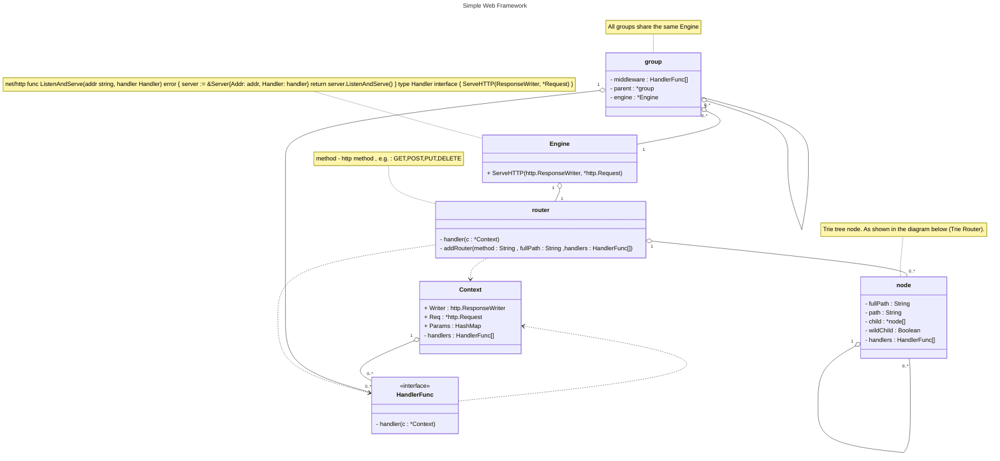
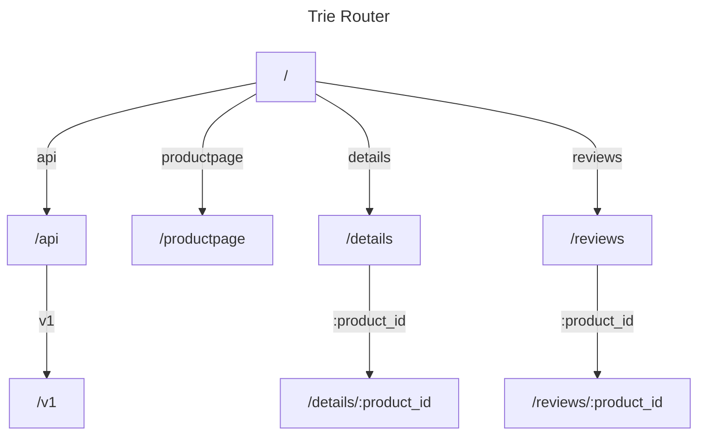

# Simple

Simple is a simple web framework written in Go


## Getting started


```bash
github.com/adrian-lin-1-0-0/simple
```

### A Simple Example


```go
package main

import (
	"github.com/adrian-lin-1-0-0/simple"
)

func main() {
	r := simple.Default()
	r.GET("/hello", func(c *simple.Context) {
		c.HTML("<h1>Hello</h1>")
	})

	v1 := r.Group("/v1")

	v1.GET("/hello", func(c *simple.Context) {
		a := []int{1, 2, 3}
		println(a[3])
		c.HTML("<h1>Hello v1</h1>")
	})

	v2 := r.Group("/v2")

	v2.GET("/hello", func(c *simple.Context) {
		c.HTML("<h1>Hello v2</h1>")
	})

	r.Run(":9999", func() {
		println("Server is running on port http://localhost:9999")
	})
}

```

## Class Diagram



