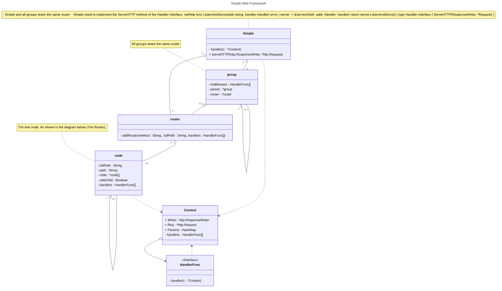
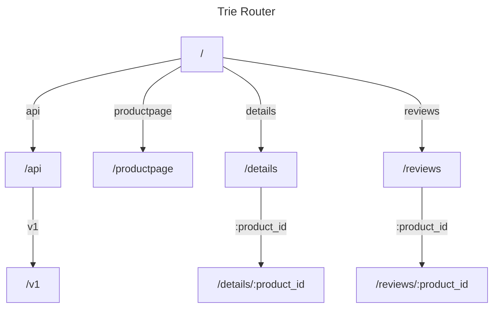

# Simple

Simple is a simple web framework written in Go


## Class Diagram






## Getting started

### Installation

```sh
go get github.com/adrian-lin-1-0-0/simple
```

### A Simple Example

```go
package main

import (
	"github.com/adrian-lin-1-0-0/simple"
)

func main() {
	r := simple.Default()
	r.GET("/hello", func(c *simple.Context) {
		c.HTML("<h1>Hello</h1>")
	})

	v1 := r.Group("/v1")

	v1.GET("/hello", func(c *simple.Context) {
		a := []int{1, 2, 3}
		//recovery
		println(a[3]) // panic: runtime error: index out of range [3] with length 3
		c.HTML("<h1>Hello v1</h1>")
	})

	v2 := r.Group("/v2")

	v2.GET("/hello", func(c *simple.Context) {
		c.HTML("<h1>Hello v2</h1>")
	})

	r.Run(":8888", func() {
		println("Server is running on port http://localhost:8888")
	})
}
```