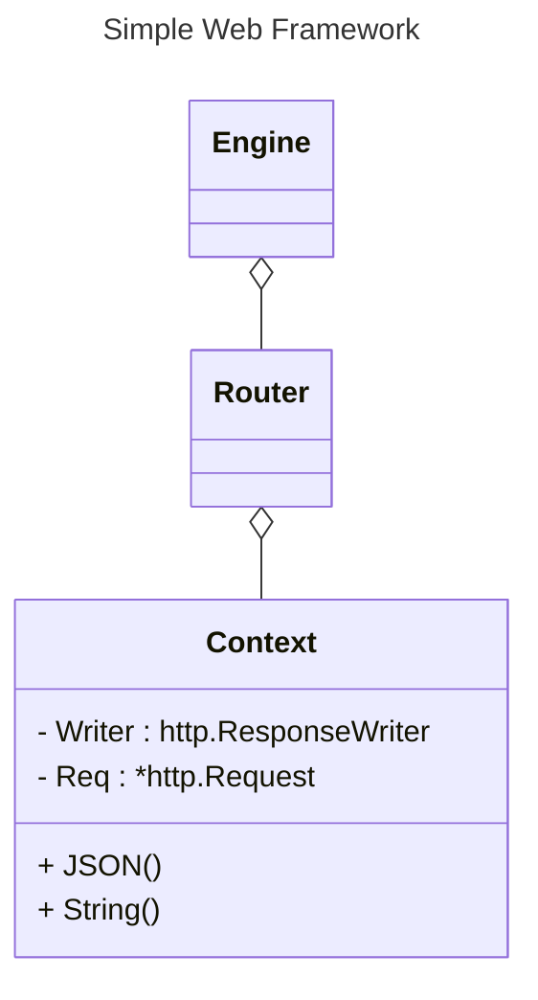
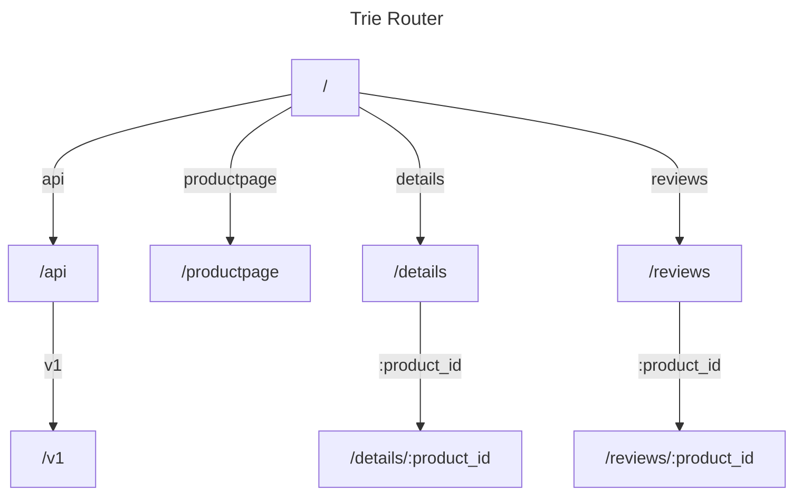

# Simple

Simple is a simple web framework written in Go

```mermaid
---
title: Simple Web Framework
---
classDiagram

    class Engine{
        
    }
    class Router{

    }
    class Context{
        - Writer : http.ResponseWriter
        - Req : *http.Request 
        + JSON()
        + String()
    }

    Engine o-- Router
    Router o-- Context
    
```

```mermaid
---
title: Trie Router
---
graph TB
    / --->|api| /api
    / --->|productpage| /productpage
    / --->|details| /details
    / --->|reviews| /reviews
    /reviews --->|:product_id| /reviews/:product_id
    /details --->|:product_id| /details/:product_id
    /api --->|v1| /v1  
```